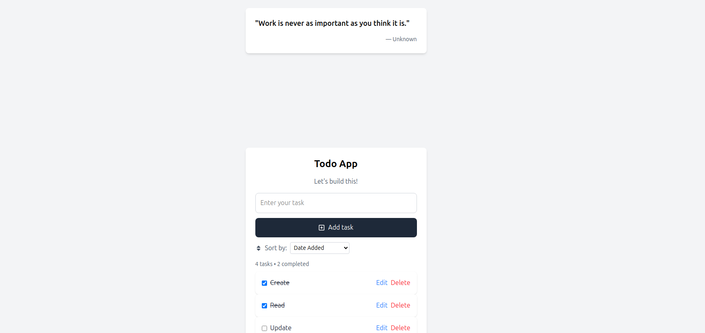

# React Todo App with Inspirational Quotes

A simple, elegant todo application built with React that helps users manage their tasks efficiently while providing motivational quotes for inspiration.

## Features

- Create, read, update, and delete tasks
- Mark tasks as complete/incomplete
- Sort tasks by date added, alphabetically, or completion status
- Local storage persistence to keep your tasks between browser sessions
- Inspirational quotes to keep you motivated
- Clean, responsive user interface

## Technologies Used

- React
- React Icons
- localStorage for data persistence
- UUID for unique task identification
- External quotes API integration

## Screenshot



## Demo

Check out the live demo of the application:

[Live Demo](https://productivity-dashboard-ten.vercel.app/)

## Usage

- **Adding a task**: Type your task in the input field and click "Add task" or press Enter
- **Completing a task**: Click the checkbox next to a task to mark it as complete
- **Editing a task**: Click on the task text to edit it
- **Deleting a task**: Click the trash icon to remove a task
- **Sorting tasks**: Select your preferred sorting method from the dropdown menu
- **Reading quotes**: View inspirational quotes displayed within the app interface

## Project Structure

```
src/
├── components/
│   ├── TodoApp.jsx     # Main application component
│   ├── TodoTile.jsx    # Individual todo item component
│   └── QuoteDisplay.jsx  # Component for displaying inspirational quotes
├── App.js              # Root component
└── index.js            # Entry point
```

## Local Storage Implementation

The app uses browser localStorage to persist todos between sessions:

```javascript
// Load from localStorage on component mount
useEffect(() => {
  try {
    const storedTodos = localStorage.getItem("todos");
    if (storedTodos) {
      setTodos(JSON.parse(storedTodos));
    }
  } catch (error) {
    console.error("Failed to load todos:", error);
  }
}, []);

// Save to localStorage when todos change
useEffect(() => {
  try {
    localStorage.setItem("todos", JSON.stringify(todos));
  } catch (error) {
    console.error("Failed to save todos:", error);
  }
}, [todos]);
```

## Quote Feature

The app integrates inspirational quotes to help keep users motivated while managing their tasks. Quotes are displayed prominently within the interface and can provide that extra bit of motivation needed to complete your tasks.

## Future Enhancements

- Add categories/tags for tasks
- make a dashboard like style
- Implement due dates and reminders
- Add drag-and-drop reordering
- Dark mode toggle
- User accounts with cloud storage
- Quote favorites and sharing capabilities
- Custom quote collections
